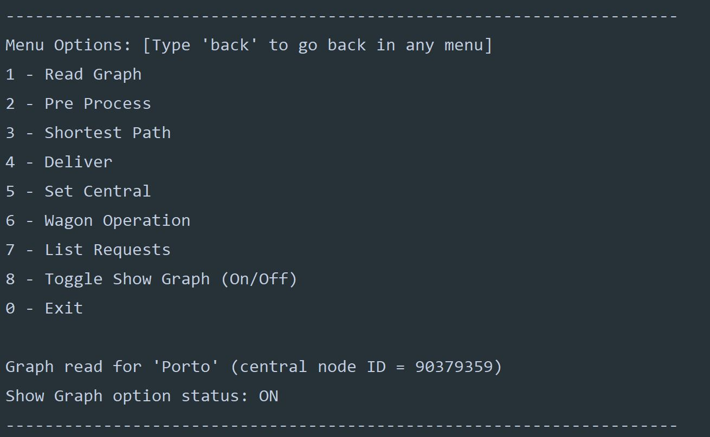
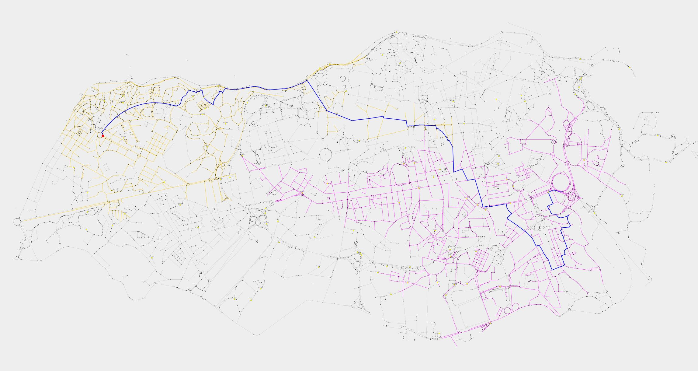
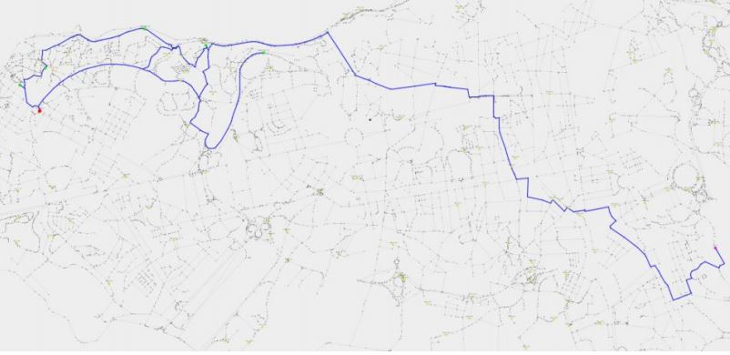

# Meat Wagons

## Gallery

### Menu

  

### Shortest Path (Bidirectional A*)

  

### Deliveries

  

## Development
[Documentation](doc/report2.pdf)

### Technologies 
* C++
* [GraphViewer](https://github.com/STEMS-group/GraphViewer)

**Note** - If you'll use an IDEA to try it, make sure the working directory ends in /meat-wagons \
**Disclaimer** - This repository was created for educational purposes and we do not take any responsibility for anything related to its content. You are free to use any code or algorithm you find, but do so at your own risk.
